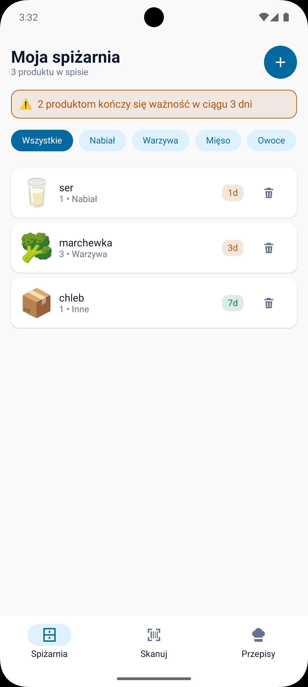
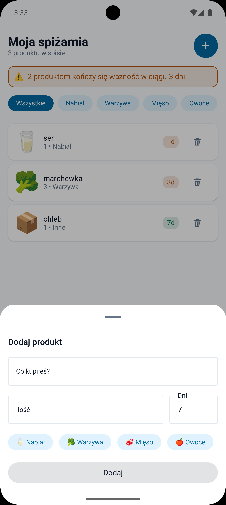
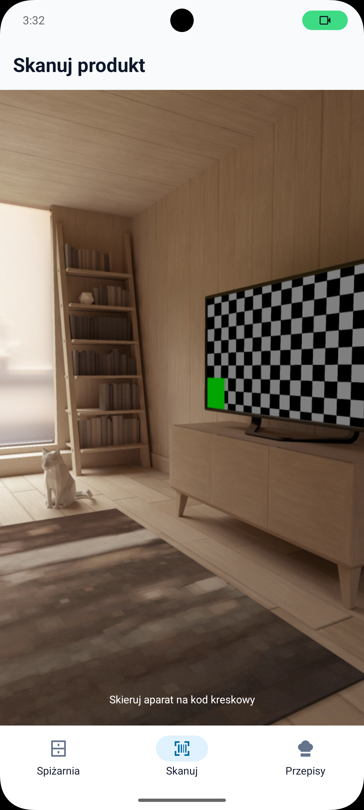
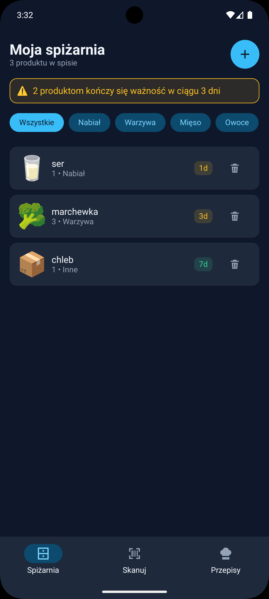

<div align="center">


# Appotato

**Track what is in your fridge, and eat it before it goes off.**

[](https://github.com/dawidpiechaczek/appotato/actions/workflows/ci.yml)
[](https://kotlinlang.org)
[](https://www.jetbrains.com/compose-multiplatform/)
[](#getting-started)

</div>

Appotato is a Kotlin Multiplatform app that helps households waste less food. Scan a barcode or type
a product in, and it keeps track of what expires when — sorted by urgency, so the thing you need to
cook tonight is at the top.

One Kotlin codebase, one Compose Multiplatform UI, Android and iOS.

## Screenshots

| Pantry | Add an item |
|---|---|
|  |  |

| Scanner | Dark mode |
|---|---|
|  |  |

## What it does

- **Expiry at a glance** — items sort soonest-first, with a colour that says how urgent they are:
  red for expired, amber inside three days, green otherwise. A banner counts what needs attention.
- **Barcode scanning** — CameraX and ML Kit on Android, AVFoundation on iOS, behind one shared
  Composable. The code is stored with the item; resolving it to a product name is not built yet.
- **Categories** — dairy, vegetables, meat, fruit, drinks, other. Filterable from the list.
- **Works offline** — everything lives in a local Room database. No account, no network required.
- **Light and dark** — one palette per mode, every text role at WCAG AA on its own background.

Two things are deliberately unfinished, and the app is honest about both: **Recipes** is an empty
tab until there is a real source of recipes, and **billing** is bound to a no-op implementation, so
every purchase fails and everyone is on the free tier.

## Architecture

```
composeApp/          app shell — three tabs, the Koin graph, the one iOS framework
features/
  pantry/            the main screen: list, add sheet, scanner tab, free-tier gate
  paywall/           Pro subscription screen
  recipes/           placeholder
  login/             module shell, no sources yet
shared/
  ui-components/     design system: colours, typography, buttons, cards, chips, icons
  database/          Room KMP — one database for the whole app
  billing/           subscriptions and entitlements, vendor-neutral
  barcode-scanner/   camera and permissions, expect/actual per platform
  telemetry/         analytics and crash reporting
  remote-config/     server-controlled values
  app-update/        version gate on top of remote config
  serialization/  storage/  dispatchers/
build-logic/         convention plugins — every module's build config lives here
```

Each capability splits into `api` (contracts), `implementation` (internal classes) and `fake` (test
doubles). Features never depend on each other; the app shell wires them together with plain lambdas.
Screens follow MVI: a `StateFlow<State>`, a single `onIntent`, and a `Channel<Effect>` for one-shot
events like "show the paywall".

Vendor names stay out of `api` modules. Swapping Firebase for something else, or the no-op billing
for a real store, is a change in one `implementation` module and one line in the DI graph.

## Tech

Kotlin Multiplatform · Compose Multiplatform · Room (KMP) · Koin · Coroutines · kotlinx-datetime ·
CameraX + ML Kit (Android) · AVFoundation (iOS) · Firebase Analytics, Crashlytics and Remote Config
· detekt · Kover

## Getting started

Requires JDK 23 and, for iOS, Xcode.

```bash
git clone git@github.com:dawidpiechaczek/appotato.git
cd appotato
./gradlew assembleDevDebug
```

For iOS, open `iosApp/iosApp.xcodeproj` and run the `Appotato-dev` scheme. Gradle builds the shared
framework from an Xcode build phase, so there is nothing to run first.

Three environments — `dev`, `staging`, `prod` — each with its own application id and Firebase
project. On Android they are product flavors, on iOS schemes and xcconfigs.

### Everyday commands

```bash
./gradlew :features:pantry:implementation:build   # one module: compile, detekt, coverage, tests
./gradlew assembleDevDebug detekt koverVerify     # before committing — no iOS, one Android variant
./gradlew build                                   # everything, iOS linking included
```

The full build takes about four and a half minutes from clean; the other two are seconds. Reach for
it when you touch `shared/` or `build-logic`, or before pushing.

Adding a module goes through the generator rather than by hand:

```bash
./scripts/new-module.sh features:shopping-list --api --impl --mvi
```

## Testing

Unit tests live in `commonTest` and run on every target. Business logic — ViewModels, mappers,
version comparison, serialization — is covered to 100% and gated by Kover, so a drop fails the
build. Composables, camera code and DI wiring are not unit tested; repository-wide line coverage is
therefore around 21%, and that number is mostly a measure of how much of the app is UI.

Test doubles are hand-written `fake` modules rather than a mocking library.

## Contributing

`CLAUDE.md` documents the architecture decisions, the conventions the code follows, and the traps
that have already cost someone an afternoon — read it before the first change.
